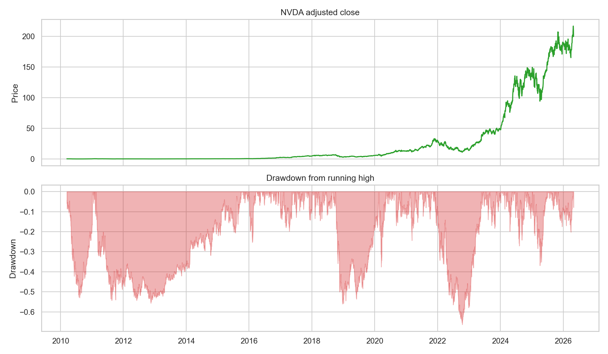
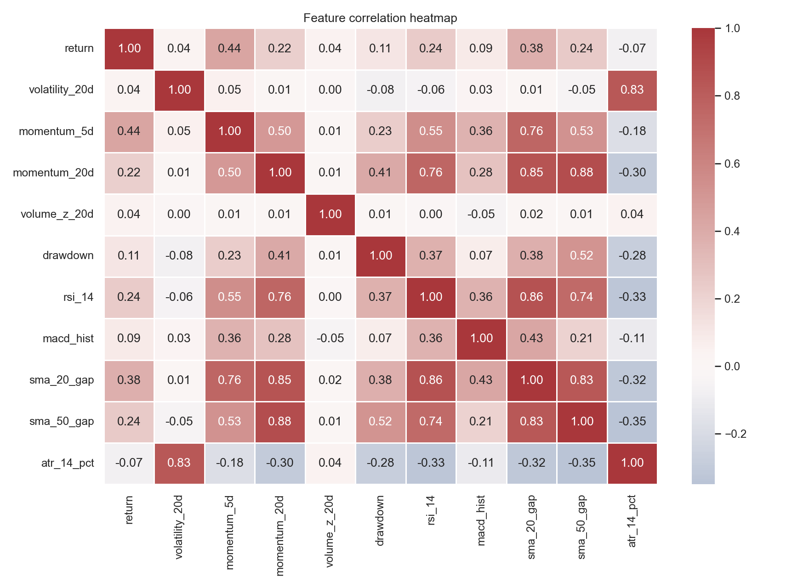
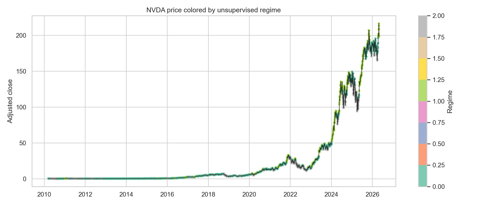
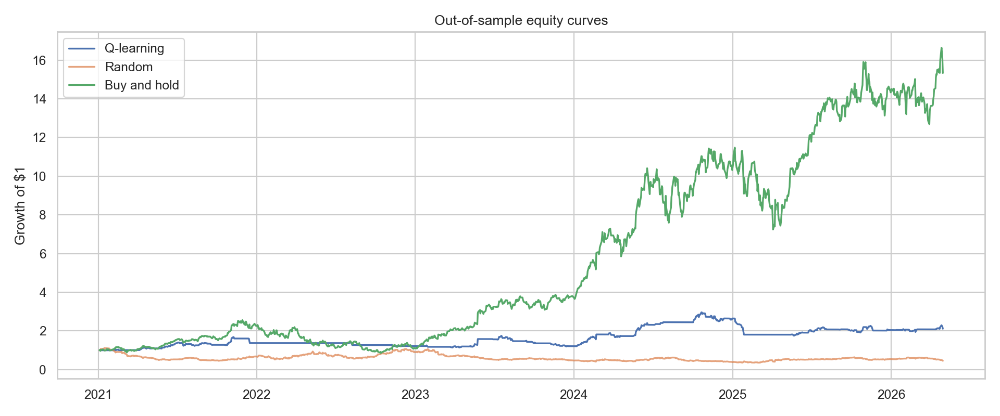

# NVDA Market Regimes and RL Trading Agent

This project combines unsupervised learning and reinforcement learning on daily NVIDIA (`NVDA`) stock data from 2010 onward.

The unsupervised part discovers market regimes with k-means and PCA. The RL part compares Q-learning, a lightweight PPO-style policy, random trading, and buy-and-hold.

## How To Run

```powershell
.\.venv\Scripts\Activate.ps1
pip install -r requirements.txt
```

Refresh the data first:

```powershell
$env:PYTHONPATH="src"
.\.venv\Scripts\python.exe scripts\download_data.py
```

The RL notebook trains models, saves them in `models/`, reloads them, and only then evaluates the test-period returns.

Saved artifacts include:

- `models/q_learning.pkl`
- `models/q_no_unsup.pkl`
- `models/ppo_scaler.pkl`
- `models/ppo_60s.pkl`
- `models/ppo_300s.pkl`
- `models/ppo_600s.pkl`

Then start Jupyter:

```powershell
.\.venv\Scripts\python.exe -m notebook
```

Run notebooks in order:

1. `notebooks/01_eda.ipynb`
2. `notebooks/02_unsupervised_regimes.ipynb`
3. `notebooks/03_rl_trading_agent.ipynb`

## Project Structure

```text
.
|-- data/
|   |-- raw/
|   `-- processed/
|-- notebooks/
|   |-- 01_eda.ipynb
|   |-- 02_unsupervised_regimes.ipynb
|   `-- 03_rl_trading_agent.ipynb
|-- reports/
|   `-- figures/
|-- scripts/
|   |-- download_data.py
|   |-- create_notebooks.py
|   `-- generate_readme_figures.py
|-- src/
|   `-- nvda_rl/
|       |-- data_downloader/
|       |-- features.py
|       |-- env.py
|       |-- agents.py
|       |-- ppo.py
|       `-- evaluation.py
`-- requirements.txt
```

## Key EDA Graphics



After feature warmup, NVDA increased from about `$0.41` to about `$198.45`. The same period still had a max drawdown near `-66%`, so the project should not evaluate only upside.



The strongest direct relationship with daily return is 5-day momentum. ATR/range risk is slightly negative versus same-day return, which supports separating momentum features from risk features.

## Regime Graphics



The k-means regimes are economically interpretable: one stress regime with negative average return, one normal positive regime, and one strong momentum regime.

## RL Graphic



Buy-and-hold is a difficult benchmark for NVDA because the test period is strongly bullish. The RL strategies are still useful for learning because they show how transaction costs, overtrading, and regime features affect policy behavior.

In the executed notebook, all test results come from saved-and-reloaded models. Buy-and-hold gained about `1,424%` out of sample. The best PPO-style timed run was the 5-minute saved model, but it still lost about `77%`, so longer training did not solve the policy problem.

## Reward Definition

```text
r_net_t = a_(t-1) * return_t - cost * |a_t - a_(t-1)|
```

The agent earns return from yesterday's position and pays a cost when changing today's position.

## Review Talking Points

- Regimes only help if they describe meaningful market states.
- Q-learning is interpretable but needs feature binning.
- PPO uses continuous features and lets us compare whether longer training time helps.
- This is a learning project, not a production trading strategy. A real strategy would need walk-forward testing, slippage, and stricter overfitting controls.
